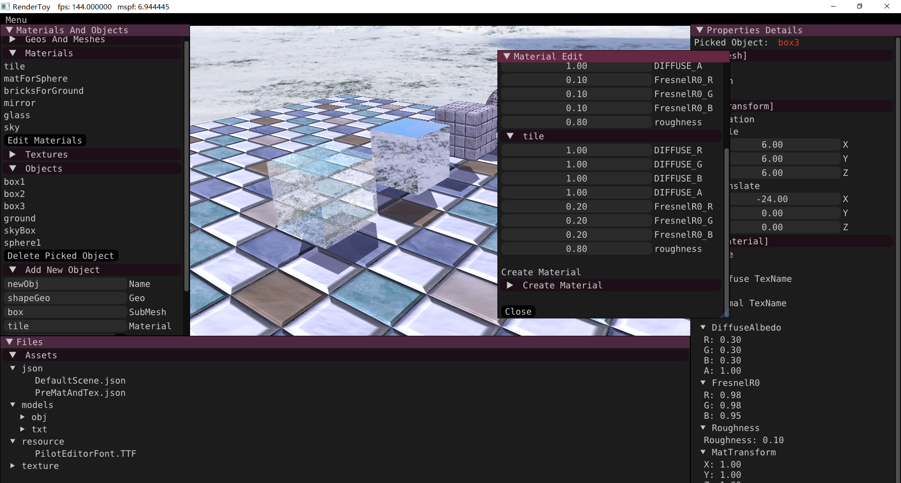
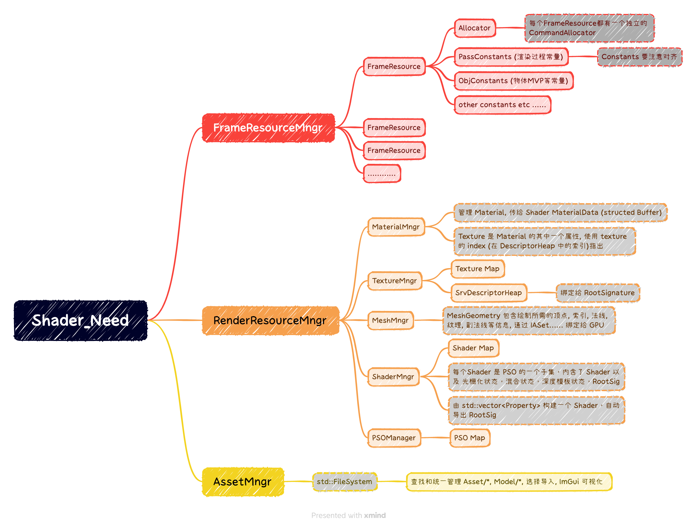
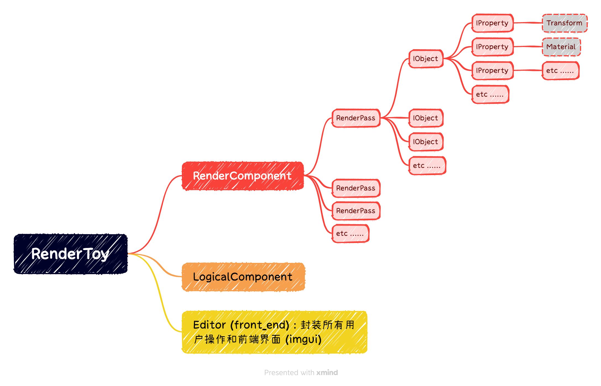

# RenderToy
*Toy Renderer based on CDX12.*
 
*Just a Toy for me to play some Graphics algorithm [DEV].*

---
## ***Design***

 

**将操作前端,渲染部分和逻辑部分抽离开来**

---

## ***Set up***

* *C++20*
* *Clang/MSVC*
* *CMake*
* *Unicode字符集*
* *DirectXTK12*
* *ImGui*
* *Tencent/rapidjson*
