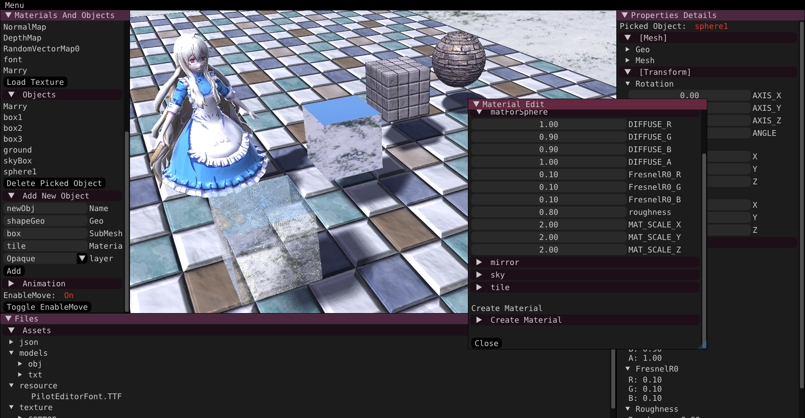

# RenderToy
*Toy Renderer based on CDX12.*

```txt
           __________                     .___             ___________             
           \______   \  ____    ____    __| _/ ____ _______\__    ___/____  ___.__.
            |       _/_/ __ \  /    \  / __ |_/ __ \\_  __ \ |    |  /  _ \<   |  |
            |    |   \\  ___/ |   |  \/ /_/ |\  ___/ |  | \/ |    | (  <_> )\___  |
            |____|_  / \___  >|___|  /\____ | \___  >|__|    |____|  \____/ / ____|
                   \/      \/      \/      \/     \/                        \/     
```


<br/>



---
## ***Design***


<br/>

**Separate the editor frontend, rendering system, and logic system**


---

## ***Set up***

* *C++20*
* *WIN32/MSVC Only*
* *CMake*
* *ImGui*
