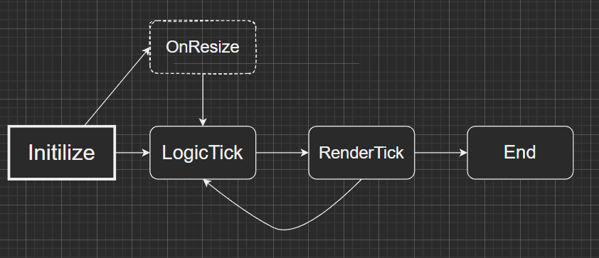

# RenderProcess

* 整体的渲染过程分为多个 Pass，每个 Pass 都有自己的内含资源, 每个 Pass 从 DescriptorHeapMngr 中分配自己所需的 CPU, GPU 资源
* 每个 Pass 都可以通过 Public Mngrs 拿到一些整个系统中公共的资源 (Mesh, Texture, Material, PSO etc)
* Pass 要尽可能的薄, Pass 与 Pass 之间要尽可能解耦合

